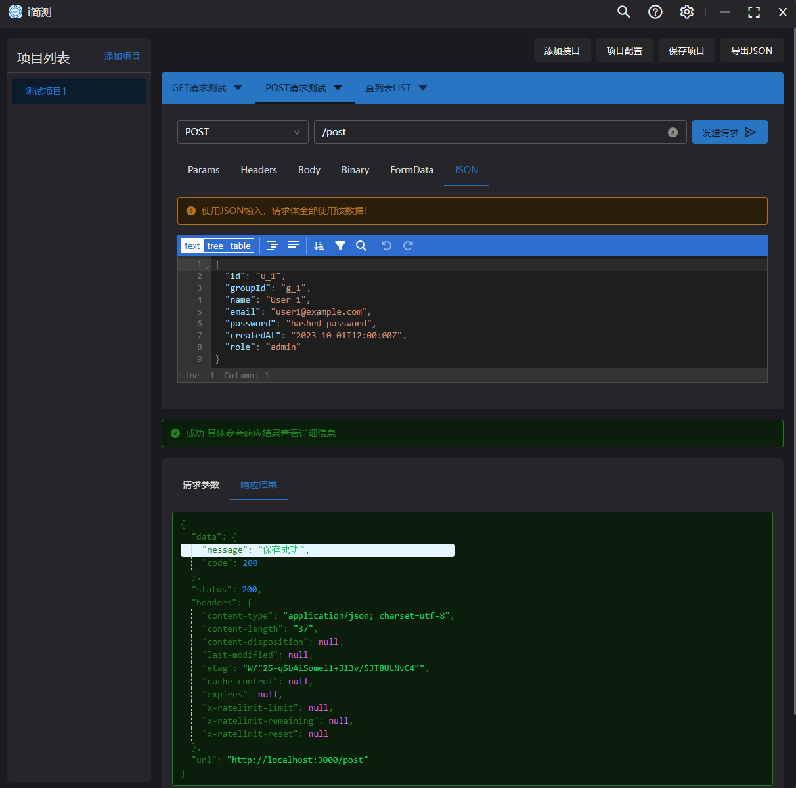
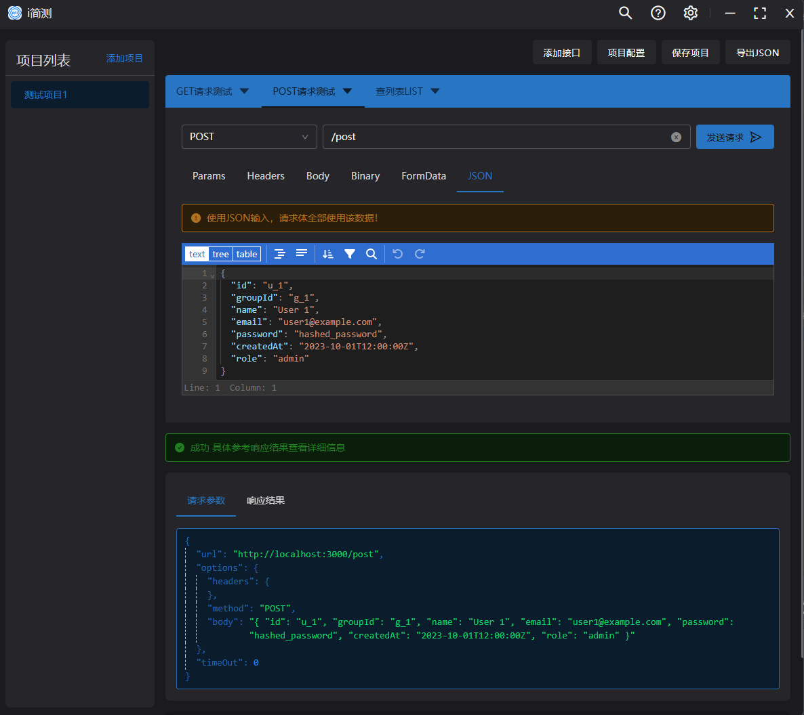

# i 简测 - 极简本地化 API 测试工具

## 产品概述

i 简测是一款轻量级、完全本地化运行的 API 测试工具，专为开发者设计，具有以下核心特点：

- **零配置开箱即用**：无需复杂设置，下载即用
- **100%本地运行**：所有数据保存在本地，保障隐私安全
- **完全免费**：无订阅、无内购、无功能限制
- **极简界面**：专注于核心 API 测试功能，去除冗余设计

## 预览

## 核心功能

### 1. 基础请求支持

- 支持 HTTP/HTTPS 协议
- 支持 GET, POST, PUT, DELETE 等常见方法
- 原生支持 JSON, Form-data 等多种请求格式

### 2. 请求管理

- 历史请求记录支持保存
- 请求集合分组管理
- 支持导出请求配置

### 3. 响应处理

- 格式化显示 JSON/XML 响应
- 响应时间统计
- 响应头详细查看

### 4. 环境变量

- 本地环境变量管理
- 支持变量快速切换
- 变量可在请求 URL/Header/Body 中使用

## 路线图

1. v1.0 基础版 (当前)

   - 核心 API 测试功能
   - 基础历史记录

2. v1.5 增强版
   - 不同环境请求测试（浏览器和服务端发送请求）
   - 更多请求格式支持
   - 不同请求库工具支持测试
   - 接口导入导出
   - 支持 JSON/YAML/CSV 等格式导入导出

## 下载与支持

- 支持平台：window [macOS, Linux 没 mac 笔记本不支持先！]
- 下载方式：
- [点击下载 im-api-test-1.0.0-setup.exe](https://gitee.com/irming46/i-simple-test/releases/download/1.0.0/im-api-test-1.0.0-setup.exe)
- 问题反馈：作者微信(微信号：Tomin_6688)或(邮件1689732695@qq.com)

i 简测致力于为开发者提供最简单纯粹的 API 测试体验，无需担心数据安全，无需忍受复杂配置，让 API 测试回归本质。
